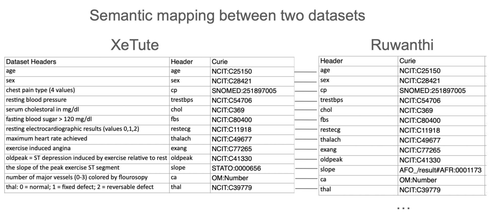
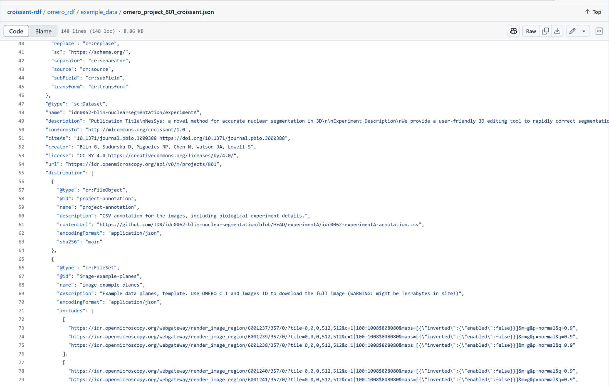

# Introduction
At the SWAT4HCLS 2025 Hackathon, we continued our work on dataset interoperability and AI-readiness, extending our efforts from the 2024 Elixir Biohackathon. This report outlines the progress made in graph serialization, metadata embedding, and knowledge graph analysis, which further enhance machine learning workflows and data integration.

## Background

As the volume and complexity of datasets in bioinformatics and machine learning increase, ensuring that these datasets are properly annotated and integrated becomes essential. Metadata serves as a critical layer for documenting dataset attributes, enabling efficient data discovery, analysis, and reuse. However, current metadata standards often lack the necessary detail or interoperability required for advanced applications, especially in AI. The Croissant metadata format `[@citesAsAuthority:citesAsSourceDocument:10.1145/3650203.3663326]`, developed by MLCommons, attempts to address this by providing a standardized approach to representing machine learning-ready datasets. However, our work has highlighted challenges in its adoption, particularly when using controlled vocabularies to describe dataset elements. One of our key findings was that the Croissant schema’s implicit relationships between fields can make it difficult to interpret or map to controlled vocabularies like EDAM, limiting its effectiveness in ensuring consistent and meaningful annotations.
This work began at the DBCLS BioHackathon 2024 with the development of croissant-rdf `[@citesAsPotentialSolution:citesAsSourceDocument:extends:steinberg2024bridging]`, a toolkit for using Croissant metadata as a knowledge graph in RDF. At BioHackathon Europe 2024, we expanded our efforts by comparing schema usage between Hugging Face and Kaggle and experimented with supplying life sciences datasets using the Croissant specification. These efforts aim to standardize dataset metadata and improve AI-readiness for machine learning applications in the life sciences.

### Graph Serialization and Loading into Qlever

One of the core tasks involved testing the process of loading serialized datasets using the Turtle format, without altering the data itself. This allowed us to evaluate how well Qlever `[@citesAsPotentialSolution:bast2017qlever]`, a high-performance query engine for graph data, handled large datasets and complex queries.
Triple stores, such as Qlever, are specialized databases designed to store and query data in the form of triples (subject, predicate, object). This format is ideal for representing knowledge graphs and other interrelated data, making triple stores particularly useful in applications like bioinformatics, where relationships between data points are complex and dynamic.
Rather than making changes to the underlying data, our focus was on determining optimal loading strategies and assessing the performance of Qlever when handling datasets of significant size. We specifically optimized the Qlever script to load approximately 900MB of graph data, improving its ability to process large datasets for federated queries. A script for loading data into Qlever was created and made available in the croissant-rdf repository, providing a resource for others to test and experiment with the process.

### Harmonizing Dataset Field Names with Biomedical Ontologies

The curation of column names was a key task, particularly focusing on datasets from Hugging Face within the life sciences domain. A major challenge in working with diverse datasets is ensuring that the terminology used to describe data elements is consistent and standardized. This is where shared controlled vocabularies come into play. By aligning data elements with well-established ontologies, we ensure that terms are defined consistently, which is critical for data interoperability and integration across different platforms and tools.
To achieve this, we specifically identified datasets and generated mappings from the column headers to controlled vocabulary terms in the NCIT (National Cancer Institute Thesaurus). The NCIT provides a comprehensive set of standardized terms used across the biomedical field, which facilitates the clear and consistent interpretation of dataset attributes. Our process involved manually reviewing column names and matching them to corresponding terms in NCIT, ensuring that metadata annotations aligned with these standard ontology values.
The use of controlled vocabularies like NCIT not only improves the semantic meaning of the metadata but also enhances the discoverability of datasets. Researchers can search and query datasets more effectively when they share a common understanding of the terminology, leading to better data reuse and collaboration across disciplines. This also enables the joining of datasets from different sources, making it possible to combine and compare data across studies and domains.
Ultimately, this work supports the goal of enabling complex queries across datasets by leveraging the knowledge graph structure. By using ontologies to standardize metadata, we can more easily query and analyze data from multiple datasets, allowing for sophisticated federated queries and more comprehensive insights in bioinformatics and machine learning contexts.

This image illustrates the semantic mapping between two datasets, XeTute `[@citesAsDataSource:xetute]` and Ruwanthi `[@citesAsDataSource:ruwanthi]`, by aligning dataset headers with ontology-backed CURIE annotations. By curating these semantic annotations, we enhance dataset interoperability, enabling more robust model training and testing across multiple datasets. This highlights the need for integrating such annotations into the Croissant specification metadata to standardize and improve AI-ready datasets.

### Embedding Croissant Metadata in Parquet Files
As an exploration into improving dataset usability in machine learning, we embedded Croissant metadata directly into Parquet files. By storing this metadata under a dedicated "croissant" key, we created self-describing data files that allow dataset attributes to be easily accessed and understood within AI workflows. This approach facilitates more intuitive interactions with the dataset, as the metadata is stored alongside the data itself.
The goal was to enable structured queries using DuckDB `[@citesAsPotentialSolution:citesForInformation:duckdb]`, which allows for fast and efficient querying over the resulting Parquet files. This integration also supports advanced analytics and exploration of the data, providing a streamlined experience for users without the need for external metadata sources. The process was implemented within a Jupyter Notebook, ensuring seamless integration with existing tools like Hugging Face, and laying the groundwork for more dynamic data exploration and querying in bioinformatics and machine learning applications.

## Enhancing AI-Ready Datasets

We expanded our work to include contributions to the Life Sciences collection and collaborations with BiohackEU, focusing on preparing more datasets for AI-readiness. A particular highlight was the development of a script to generate Croissant metadata for imaging datasets, specifically within IDR platform `[@usesDataFrom:williams2017image]`. IDR runs OMERO `[@citesAsPotentialSolution:usesMethodIn:williams2017image]` as the imaging repository, allowing to extract metadata for the IDR published images using OMERO metadata tools `[@obtainsSupportFrom:josh_moore_2024_14415961]` `[@usesMethodIn:obtainsSupportFrom:dvoretskii_2025_15268798]`. We used the Linked Data representation obtained from the OMERO metadata tooling for the IDR study instances. This information was used to cherry-pick the important things for the CroissantML representation of the IDR study instances. An IDR study would be a “dataset” in the CroissantML sense, consisting of images that are represented as FileObjects in Croissant. 

This effort supports ongoing initiatives to make datasets more accessible and usable in machine learning contexts. 

Firstly, a challenge for the bioimaging datasets is the size of the images, which can reach terabytes. Direct download of this size is not feasible for a normal server. OME-Zarr `[@citesAsPotentialSolution:usesMethodIn:moore2021ome]` comes to help here, and allows to fetch images in tiles, which are a small chunk of the original size. Unfortunately, not all of the IDR studies (and other Bioimaging portals) currently support Zarr, but we hope the numbers will increase, allowing to make more Bioimaging data AI-ready for the wider scientific and Machine Learning community. Furthermore, OMERO data model does not require citation, license and creator (persistent unique identifier) information, which can make compliant dataset usage problematic. Combined with this comes the fact that not all OMERO instances are public, therefore some of the data can only partially be made accessible to the Croissant data registry and/or require authentication to proceed. This is not the case now, but there have been research groups who only want authenticated users to discover their metadata e.g. in the DataPLANT community `[@citesAsPotentialSolution:usesMethodIn:weil2023plantdatahub]`. Last but not least, it may be that OMERO servers can not hold the workload of multiple crawlers concurrently downloading the image data. In an adverse scenario where the download requests to OMERO resources in the Croissant registries will be too intensive, some OMERO repositories might restrict submission of their data to Croissant repositories. It might be great to think in advance how to ensure a smooth download queue for the published OMERO datasets.   

## VCF files to Dataframes

As part of our effort to make genomic data more AI-ready, we explored methods for loading Variant Call Format (VCF) data directly into dataframes using modern tooling. Specifically, we tested two libraries—Biobear and Oxbow—on datasets from the Thousand Genomes Project. Our goal was to streamline the path from raw genomic data to structured formats suitable for analysis and machine learning workflows. While both tools successfully parsed and structured basic metadata from the VCF files, neither was able to capture the full variant call information, which is critical for downstream genomic analysis. This limitation highlights the need for more robust support in tooling that bridges genomics and AI.
[Colab notebook demonstrating a potential solution with Oxbow and Biobear](https://colab.research.google.com/drive/1lPUaZnASjBLb7KfL28Qxa3qDqQ7YOykI?usp=sharing)

[Oxbow Github repository](https://github.com/abdenlab/oxbow)
[Biobear Github repository](https://github.com/wheretrue/biobear)

## Updating Croissant-Editor for Controlled Vocabularies

Significant updates were made to the Croissant-editor, enabling support for tagging dataset columns with controlled vocabularies such as EDAM. This enhancement improved the user experience by simplifying the process of assigning ontology terms, which is crucial for accurate metadata annotation and dataset curation. However, due to the implicit relationships in the Croissant schema, interpreting how to apply controlled vocabularies presented a challenge.
After reviewing the Croissant Format Specification, we have identified several areas where clarification or refinement could enhance the specification's clarity and usability:​
Implicit IRI Construction: The specification allows for the implicit construction of IRIs by concatenating base IRIs with local identifiers. However, it is unclear whether there is a validation mechanism to ensure that these constructed IRIs are valid and resolve correctly. Implementing a validation step or providing guidelines for constructing valid IRIs could prevent potential issues with data interoperability.​

Inconsistency Between Specification Examples and Data Class Definitions: In some instances, the specification examples illustrate fields as single string values, whereas the corresponding data class definitions expect a list of strings. For example, a field might be shown as "value": "example" in the example, but the data class defines it as List[str]. This discrepancy could lead to confusion among implementers. Aligning the examples with the data class definitions would improve clarity.​

Ambiguity of equivalentProperty Usage: The equivalentProperty attribute is introduced in the context of typing RecordSets, but its intended use and implications are not clearly defined. It is not specified whether this attribute is meant to denote semantic equivalence to properties in external ontologies or to serve another purpose. Providing a more detailed explanation and usage examples would help users understand how to apply this attribute effectively.

## Knowledge Graph Analysis

We conducted network analysis of the knowledge graph, studying its topology to identify key nodes, clusters, and relationships. This analysis provided valuable insights into the structure and connectivity of the graph, aiding in model analysis and dataset integration. Our findings contribute to a deeper understanding of how datasets can be linked and aligned with different ontologies. In particular, we provide code that could be utilised to visualise several types of metadata relationships at once, allowing for troubleshooting of the relationships between entities, the “dummy variables” and schema as a whole. 
See Fig. X for visualisation of the creator and keyword relationships. The plot also suggests possible underidentification of some authors by their arxiv entries only. Larger scale analyses could reveal specific clusters of authors associated with particular keywords.

[!Visualisation of keyword and author entities linked by “creator” (creat) and “keyword” (key) relationships for a small subset of the hugging face dataset. Arrows indicate the direction of annotation.](images/graph-viz.png)

## Croissant-RDF Project Outreach and Technical Contributions

At the SWAT4HCLS hackathon, we focused on reaching the life sciences community with croissant-rdf, a tool that translates Croissant metadata into RDF to support semantic integration, discovery, and reuse of datasets. This work is part of a larger effort to make biomedical data more AI-ready by aligning metadata with semantic standards and promoting interoperability across platforms and domains. To support this vision, we also created the BioHackathon organization on Hugging Face, providing a shared space to curate, annotate, and share life sciences datasets and models using community-driven standards like Croissant.
Numerous updates were made to the croissant-rdf package during this time. The tool gained support for importing metadata from Dataverse, improved error handling, enhanced logging and packaging, keyword search functionality, and an improved QLever integration script. These improvements culminated in a new release—Xuixo 0.1.2, named after the Catalonian pastry—which is now available on PyPI.

Throughout the hackathon, we actively maintained the croissant-rdf GitHub repository, addressing open issues and documenting our progress. A poster summarizing our previous work was presented at the SWAT4HCLS hackathon, and we participated in biohackathon discussions to share updates and gather feedback for future development.

# Conclusion

The SWAT4HCLS 2025 Hackathon marked a significant step forward in our ongoing efforts to bridge the gap between machine learning and life sciences through standardized, AI-ready datasets. By enhancing tools like croissant-rdf and Croissant-editor, embedding metadata into Parquet files, and aligning dataset structures with ontologies, we addressed critical challenges in dataset interoperability, discoverability, and semantic integration. Our exploration of graph serialization, controlled vocabulary tagging, and variant call data handling further demonstrates the importance of robust, scalable tooling to support complex biomedical data workflows.
These efforts are part of a broader vision to make high-quality, annotated datasets more accessible for both domain experts and AI practitioners. Initiatives like the BioHackathon organization on Hugging Face and our work on RDF-based metadata curation reinforce a community-driven approach to building reusable infrastructure that can support cross-platform data sharing and federation.
Looking ahead, our focus will be on expanding support for bioimaging and genomics datasets, improving metadata compliance and accessibility, quantifying the connectivity of the dataset knowledge graph and addressing infrastructure challenges around large data hosting and authenticated access. By continuing to refine Croissant tools and grow the dataset ecosystem, we aim to enable more transparent, interpretable, and FAIR machine learning applications in biomedical research.
